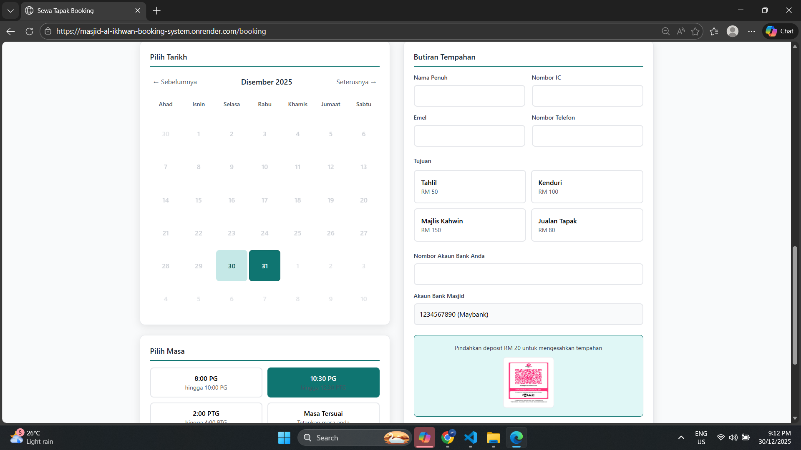
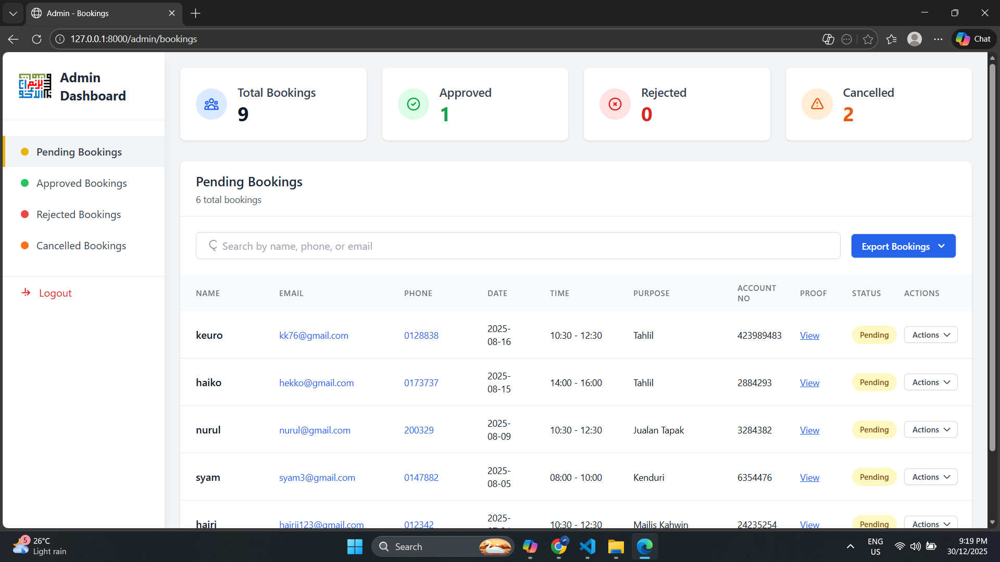

# 🕌 Masjid Booking System

A full-stack **Laravel web application** for managing mosque facility bookings efficiently.  

Users can submit booking requests without logging in, while administrators manage requests through a secure dashboard. Approved bookings automatically update availability, preventing double bookings. Email notifications are sent via the **Brevo API** to keep users and admins informed.

🔗 **Live Demo:** [Masjid Booking System](https://masjid-al-ikhwan-booking-system.onrender.com/booking)

---

## 📸 Screenshots

### User Interface


### Admin Dashboard


---

## 🚀 Features

### 👤 User
- Open booking form (no login required)  
- **Dynamic slot availability**: approved bookings automatically appear as unavailable  
- Submit booking requests  
- Receive email notifications via Brevo  

### 🛠️ Admin
- Admin dashboard (protected with login)  
- View all booking requests  
- Approve or reject bookings  
- Automated email responses to users  

---

## 🧰 Tech Stack

- **Backend:** Laravel  
- **Frontend:** Blade, Bootstrap  
- **Database:** SQLite  
- **Authentication:** Laravel Auth (for admin)  
- **Email Service:** Brevo API  
- **Deployment:** Render  

---

## 🎯 Purpose

Developed as part of the **DES3073 - Software Project Management** course to:  
- Learn **Laravel framework** and MVC structure  
- Practice **Agile development** with **Jira**  
- Build a **real-world booking system**  
- Gain experience integrating APIs and deploying a live web app  

---

## ⚙️ Local Setup

```bash
git clone https://github.com/Husainihusein/masjid-booking-system.git
cd masjid-booking-system
composer install
cp .env.example .env
php artisan key:generate
php artisan migrate
php artisan serve
